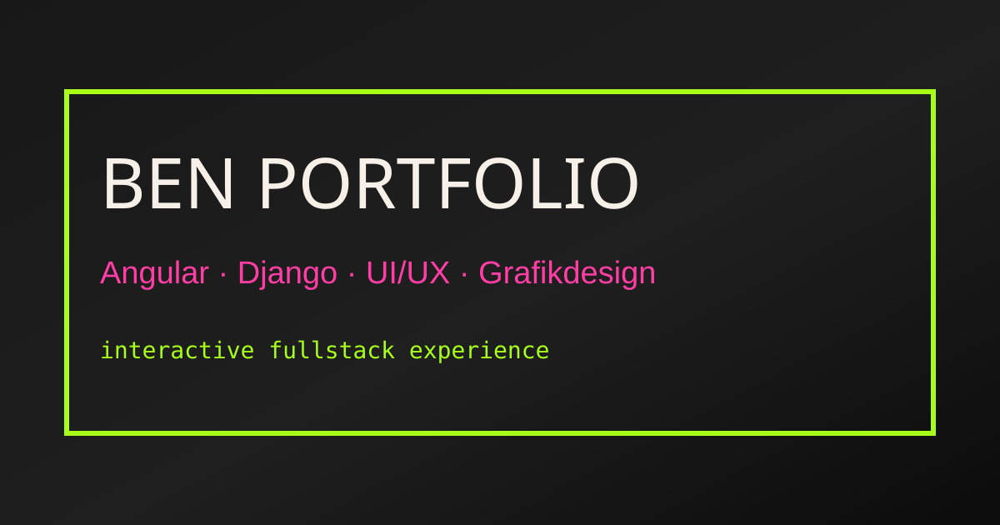

<p align="center">
  
</p>

<h1 align="center">B2FOLIO.DE</h1>

<p align="center">
  <strong>Design. Code. Repeat.</strong><br />
  An interactive Angular experience combining full-stack web development, UI/UX, graphic design, and controlled chaos.
</p>

<p align="center">
  <a href="https://b2folio.de/"></a>
  
  
  
</p>

> [!IMPORTANT]
> This repository is publicly viewable, but it is **not an open-source project**. Permission is granted solely to inspect and evaluate this work. Copying, cloning, modifying, executing, publishing, redistributing, or reusing any part of it without prior written permission is prohibited. The [B2FOLIO.DE Read-Only Source License](./LICENSE) applies.

---

```txt
┌─ b2folio.system ────────────────────────────────────────────┐
│ project     B2FOLIO.DE                                     │
│ stack       Angular · TypeScript · SCSS                    │
│ craft       Full Stack · UI/UX · Graphic Design            │
│ focus       Performance · Accessibility · SEO · Motion     │
│ state       clean structure / controlled chaos             │
└─────────────────────────────────────────────────────────────┘
```

## Contents

- [About the Project](#about-the-project)
- [Highlights](#highlights)
- [Project Areas](#project-areas)
- [Selected Case Studies](#selected-case-studies)
- [Architecture](#architecture)
- [Tech Stack](#tech-stack)
- [Project Structure](#project-structure)
- [Quality and Accessibility](#quality-and-accessibility)
- [Authorized Local Development](#authorized-local-development)
- [Scripts](#scripts)
- [Build and Deployment](#build-and-deployment)
- [License and Usage](#license-and-usage)
- [Author](#author)

## About the Project

**B2FOLIO.DE** is not a conventional one-page portfolio. It is an animated, bilingual web experience that combines a professional portfolio structure with a distinctive visual system built around MS-DOS dialogs, terminal elements, halftone assets, glitch layers, poster-style UI, scroll snapping, and interactive project scenes.

The goal is a website that remains technically controlled while making a strong visual impression: component-based, responsive, SEO-friendly, accessibility-conscious, and built without an off-the-shelf UI component library.

**Live version:** [https://b2folio.de/](https://b2folio.de/)

## Highlights

| Area | Implementation |
| --- | --- |
| **Hero Experience** | Full-screen hero with poster-style UI, halftone portrait, glitch layers, and a system dialog |
| **Startup Loader** | Custom B² boot sequence with a reduced alternative for corresponding motion preferences |
| **Themes** | Persistent dark and light modes powered by centralized theme tokens and services |
| **Accessibility** | Adjustable contrast, color-vision, typography, comfort, and motion preferences |
| **Languages** | Complete German and English content with a persistent language switcher |
| **Navigation** | Sticky navigation, custom cursor, scroll-to-top control, and body-based scroll snapping |
| **Repository Gate** | Footer button without an `href`, a security question, and a rotating stack of five error dialogs |
| **Motion** | Viewport-driven reveals, staggered animations, and performant deferred sections |
| **Case Studies** | Dedicated detail pages covering architecture, role, stack, highlights, and visual project scenes |
| **SEO** | Route-specific metadata, canonical URLs, structured data, sitemap, and social meta tags |
| **Contact** | Angular form with a CSRF-protected connection to the centralized Infrastructure API |

## Project Areas

| Route / Area | Description |
| --- | --- |
| **`/`** | Homepage with hero, about section, experience, skills, process, projects, FAQ, and contact form |
| **`/portfolio`** | Overview of the selected case studies |
| **`/projects/:slug`** | Dynamic project detail pages with individual visual direction |
| **`/snippets`** | Short technical examples with isolated demo assets |
| **`/achievements`** | Unlockable interactions and portfolio achievements |
| **`/danke`** | Confirmation page after a successful contact request |
| **`/impressum`** | Legal notice and provider information |
| **`/datenschutz`** | Privacy policy |
| **Fallback** | Custom 404 page for unknown routes |

## Selected Case Studies

| Project | Focus |
| --- | --- |
| **Intranet** | Modular Angular and Django platform with apps, roles, permissions, communication, and automation |
| **Dein Fußabdruck** | Interactive web and game project featuring simulation, animation, and gameplay logic |
| **Carly Managed** | Project management application with boards, tasks, live synchronization, and gamification |
| **Globi Flow** | Local lab-report assistance system with OCR, review workflows, a knowledge base, and patient reports |
| **Graphic Design Catalog** | Editorial design catalog with a reader, gallery, and creative project presentation |

## Architecture

| Layer | Responsibility |
| --- | --- |
| **Core** | Centralized content, data models, and services for SEO, language, themes, APIs, and application state |
| **Layout** | Global application shell containing navigation, loader, footer, overlays, toasts, and accessibility controls |
| **Pages** | Lazy-loaded route components and page-specific orchestration |
| **Shared** | Reusable experience, visual, dialog, project, and motion components |
| **Styles** | Global tokens, base rules, utilities, and project-specific case-study styles |
| **Environments** | Public environment-specific frontend configuration only |

## Tech Stack

| Layer | Technologies |
| --- | --- |
| **Framework** | Angular 21.2 with standalone components and signals |
| **Language** | TypeScript 5.9 in strict mode |
| **Reactivity** | Angular Signals and RxJS 7.8 |
| **Styling** | SCSS, CSS custom properties, and semantic design tokens |
| **UI Approach** | Custom components without Angular Material |
| **Routing** | Angular Router with lazy-loaded pages and dynamic project detail routes |
| **Testing** | Vitest 4 with jsdom through the Angular unit-test builder |
| **SEO** | Angular Meta service, canonical URLs, structured data, Open Graph, and Twitter Cards |
| **Assets** | Local variable fonts, a reduced Material Symbols font, and WebP and SVG graphics |

## Project Structure

```txt
src/
├─ app/
│  ├─ core/
│  │  ├─ data/                 # Portfolio content, translations, and project data
│  │  ├─ models/               # Content and project models
│  │  └─ services/             # API, SEO, language, theme, and application state
│  ├─ layout/                  # Global application shell and system-wide UI
│  ├─ pages/                   # Routed pages
│  └─ shared/                  # Reusable UI and experience components
├─ assets/
│  ├─ fonts/                   # Local fonts and reduced icon font
│  ├─ images/                  # Hero, loader, and project assets
│  ├─ snippet-demos/           # Isolated examples for the snippets page
│  └─ social/                  # Social and repository preview
├─ environments/              # Public frontend configuration by environment
├─ styles/                    # Tokens, base styles, utilities, and case-study styles
├─ styles.scss                # Global SCSS entry point
├─ robots.txt                 # Crawler configuration
└─ sitemap.xml                # Public sitemap
```

## Quality and Accessibility

- strict TypeScript and Angular template checks
- semantic HTML structure and a consistent heading hierarchy
- visible focus states and fully keyboard-accessible interactions
- ARIA labels for interactive elements and controls requiring additional context
- contrast-conscious dark and light themes with additional accessibility preferences
- support for reduced or disabled motion
- responsive layouts ranging from small smartphones to ultrawide viewports
- lazy-loaded routes and `@defer` blocks for resource-intensive sections
- unit tests covering central content integrity and Contact API behavior
- production budgets for the initial bundle and component styles

Material Symbols are bundled as a reduced local font, so icon rendering does not depend on an external font CDN.

## Authorized Local Development

> [!CAUTION]
> The following commands document the internal development workflow. Their publication does not grant permission to download, execute, or reuse this project. They may only be used by the rights holder or by persons who have received explicit written authorization.

An Angular 21-compatible Node.js version and npm are required.

```bash
npm ci
npm run start
```

The local Angular development server is then available at the following address by default:

```txt
http://localhost:4200
```

## Scripts

| Command | Purpose |
| --- | --- |
| `npm run start` | Starts the Angular development server |
| `npm run build` | Creates the default production build |
| `npm run build:production` | Explicitly creates the production build |
| `npm run watch` | Continuously builds using the development configuration |
| `npm run test` | Runs the unit tests |

## Build and Deployment

```bash
npm run build:production
```

The deployable browser build is generated in:

```txt
dist/ben-portfolio-experience/browser
```

The production configuration enables optimization, file hashing, environment-specific frontend configuration, and bundle budgets. `.htaccess`, `robots.txt`, `sitemap.xml`, and the local assets are copied into the build output.

## License and Usage

This project is **proprietary and not open source**. Its public visibility serves exclusively to allow professional and design-related evaluation.

Without prior explicit written permission, you may not:

- copy, clone, or permanently store the source code or assets,
- run, build, modify, publish, or host the project,
- adopt code, layouts, copy, graphics, animations, branding, or case studies,
- use the project, in whole or in part, in private, public, or commercial work,
- use its content for AI or machine-learning training, datasets, or automated reproduction,
- reuse personal data, contact details, or information from the legal notice.

Neither the public visibility of this repository nor any technically available GitHub feature grants additional usage rights. The complete [B2FOLIO.DE Read-Only Source License](./LICENSE) applies exclusively. Clearly marked third-party components remain subject to their respective license terms.

## Author

**Benjamin Bennewitz**  
Full-Stack Web Development · UI/UX · Graphic Design

[b2folio.de](https://b2folio.de/) · [GitHub](https://github.com/benjaminBennewitz) · [LinkedIn](https://www.linkedin.com/in/benjamin-bennewitz-116a12306/)

```txt
clean structure / loud visuals / controlled chaos
```
